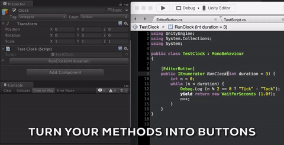

#EditorButton

Turn your methods into buttons. Incredibly useful to test your code in both editor and runtime just by adding an attribute.

##Features

* Multiple arguments
* Arguments can have default values
* Coroutines are automatically started
* Return values are printed to the console

I felt the need to create a tool that would help test my code in different conditions without having to constantly recompile or create a (clumsy) UI just for testing purposes.

##Usage

Import *EditorButton.unitypackage* to your project and add the `[EditorButton]` attribute to the methods you'd like to see displayed as buttons.

##Alternatives

[VFW](https://github.com/vexe/VFW) also provides a way to automatically generate buttons from methods but I didn't like the fact that I had to download such a big project to get such a small feature (that in most projects, is the only one that I need from there). Besides that, you need to change your code structure in order to get that feature.

